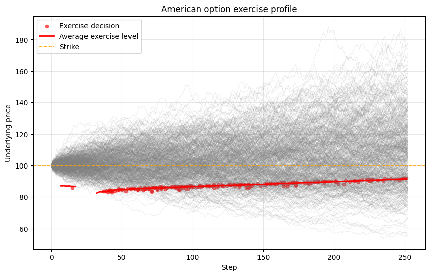

# 📈 Financial Mathematics - Options Pricing Dissertation Code

This repository implements option pricing models, ranging from classical models to newer machine learning models. 

## Features

- 📉 **Black Scholes Model** (European Calls and Puts)
- 🌲 **Binomial Tree Pricing** for European and American options
- 🎰 **Monte Carlo Pricing** with Geometric Brownian Motion
- 🧮 **American Option Pricing (Longstaff–Schwartz)** with monomial and polynomial regression bases
- 🎯 **Quasi-Monte Carlo Drivers** (Sobol, Faure, Halton-style sequences) with Brownian bridge
- 📐 **Sensitivity Methods**: finite-difference Greeks for Black–Scholes, Binomial and Monte Carlo
- 🖼️ **Path Visualisation** and Payoff Plotting
- 👨‍💻 **Data Gathering** for Stocks and their respective Options

*Average optimal exercise level for an American put estimated via Longstaff–Schwartz Monte Carlo.*

## 🛣️ Roadmap
### Stage One
- ✅ Implement Black-Scholes model for European Call and Put Options
- ✅ Implement Greeks
- ✅ Implement Data Fetching using Yahoo Finance for Option Chain data
- ✅ Implement Monte Carlo approach with Geometric Brownian Motion (GBM)
- ✅ Add Stock Price visualisation and GBM visualisation

### Stage Two
- Expand Market Data:
  - ✅ Clean Bad Implied Volatilities (fall back to Historic Volatilities)
  - ✅ Select near-the-money strikes
-  Compare model prices vs market quotes

### Stage Three
- Add Feature Engineering (log-moneyness, normalised T, volatility surface features) and their Visualisations
- ✅ Implement Longstaff-Schwartz Monte Carlo for pricing American Options
- ✅ Implement Antithetic Variates
- ✅ Provide different bases - Monomial, Laguerre, Hermite, Legendre polynomials

### Stage Four
- Implement Quasi-Monte Carlo - Research for understanding:
  - ✅ Bounds of a high-dimensional hypercube
  - ✅ Koksma-Hlawka Inequality
  - Lattice Rules
  - ✅ Faure, Halton, Sobol Sequences

### Stage Five
- Develop methods for finding sensitivities:
  - ✅ Finite Difference Black-Scholes for understanding
  - ✅ Finite Difference Method for Monte Carlo
  - ✅ Pathwise Derivative Estimates
  - (Extra) Likelihood Ratio Method

### Stage Six
- Implement Machine Learning Models:
    - ✅ Logistic Regression
    - ✅ Random Forest
    - ✅ Support Vector Machine
- ✅ Visualise predicted vs actual prices
  - Notebook: `notebooks/lsm_ml_model_comparison.ipynb`

### Extension(s)
- Extend to multi-dimensional Amerian options i.e. vector/tensor inputs rather than single-asset
- Create more realistic setups - Dividends, Transaction Costs, Stochastic Interest Rates
- Exotic Options - Bermudan Options, Shout/Chooser-lite, European Digital, Asian

## References

[1] F. Black & M. Scholes (1973). *The Pricing of Options and Corporate Liabilities.* Journal of Political Economy, 81(3), 637–654.  
[2] F. A. Longstaff & E. S. Schwartz (2001). *Valuing American Options by Simulation: A Simple Least-Squares Approach.* Review of Financial Studies, 14(1), 113–147.  
[3] J. C. Hull (2018). *Options, Futures, and Other Derivatives.* 10th Edition, Pearson.  
[4] L. Clewlow & C. Strickland (2002) *Implementing Derivatives Models*  
[5] P. Glasserman (2003) *Monte Carlo Methods in Financial Engineering*
